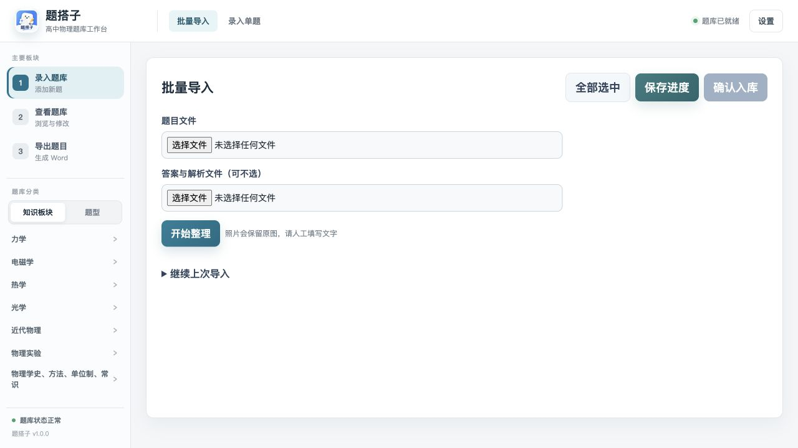

<p align="center">
  
</p>

<h1 align="center">题搭子</h1>

<p align="center">面向高中物理教师的本地题库与组卷工具。</p>

<p align="center">无需注册，题目、图片、设置和导出文件默认保存在本机。</p>

<p align="center">
  <a href="https://github.com/HelloTheWorld12138/question-bank-assistant/releases/latest">下载最新版</a> ·
  <a href="./CHANGELOG.md">更新记录</a> ·
  <a href="https://github.com/HelloTheWorld12138/question-bank-assistant/issues">反馈问题</a>
</p>

<p align="center">
  
  
</p>



## 下载

| 平台 | 文件 | 说明 |
|---|---|---|
| macOS | `Tidazi-*-macOS-arm64.dmg` | 适用于 Apple 芯片 Mac |
| Windows | `Tidazi-*-Windows-x64.zip` | 适用于 64 位 Windows，解压后运行 `题搭子.exe` |

安装包与 `SHA256SUMS.txt` 均在 [Releases](https://github.com/HelloTheWorld12138/question-bank-assistant/releases/latest) 提供。

macOS 安装包目前未经过 Apple 公证。如果首次打开时提示无法验证开发者，请在
“系统设置 → 隐私与安全性”中确认打开。

## 核心能力

- 从 Word、PDF 和图片批量整理题目，审核后再写入正式题库
- 手动录入题干、答案、解析、公式和图片，并即时预览
- 按知识板块或题型浏览题库，支持难度、年份和来源筛选
- 覆盖力学、电磁学、热学、光学、近代物理、物理实验等高中物理板块
- 勾选题目生成题目卷、答案卷或解析卷
- 导出 A4 单栏、A4 双栏和正式考试卷 Word 文档
- 可选接入阿里云百炼、DeepSeek、OpenAI 兼容接口或本地 Ollama

## 工作方式

```text
导入或录题 → 人工审核 → 题库检索 → 勾选组卷 → 导出 Word
```

题库使用 Markdown 保存，每道题都是独立文件；图片单独存放，索引可以重新生成。
删除的题目会先进入本地回收站，应用也会定期创建本地备份。

## 数据与隐私

- 默认不需要账号，也不会把整个题库上传到服务器
- 模型功能默认关闭，不影响录题、检索、组卷和备份
- API Key 写入操作系统凭据存储，不写进题库文件
- 使用云端模型前，界面会提示将要发送的内容
- 运行时题库、图片、日志、设置和导出文件均被 Git 忽略

## 使用说明

- Word 导入与导出依赖 [Pandoc](https://pandoc.org/installing.html)。未检测到 Pandoc 时，其他题库功能仍可使用。
- 数字版 PDF 可以直接提取文字；扫描件和照片在未配置离线 OCR 时会保留原图，等待人工录入。
- AI 分类与组卷建议属于可选增强，模型名称和服务地址均可在“设置”中修改。

## 本地开发

需要 Python 3.10 或更高版本。

```bash
python -m venv .venv
source .venv/bin/activate
python -m pip install -r requirements-dev.txt
python -m uvicorn app.main:app --host 127.0.0.1 --port 8000
```

浏览器打开 <http://127.0.0.1:8000>。

运行测试：

```bash
python -m pytest
```

构建桌面包：

```bash
# macOS
bash scripts/build_macos_dmg.sh

# Windows PowerShell
powershell -ExecutionPolicy Bypass -File scripts/build_windows.ps1
```

Windows 构建会生成 `dist/题搭子-Setup-版本号.exe` 安装包；它会内置 Pandoc，安装后即可
使用 Word 导入与导出，并内置 Ruby 和 MathType 转换器以识别旧版 MathType 公式。构建机需安装
[Inno Setup 6](https://jrsoftware.org/isdl.php)。

首次安装时会检查 Microsoft Edge WebView2 Runtime；若电脑尚未安装，安装器会联网下载安装。

推送与 `APP_VERSION` 一致的标签（例如 `v1.0.1`）会由 GitHub Actions 自动构建 Intel Mac、
Apple 芯片 Mac 和 Windows 安装包，并发布到 GitHub Release。

更完整的环境变量、可选工具和发布说明见
[开发说明](./docs/开发说明.md)。

## 项目结构

```text
app/          API、题库服务与桌面后端
static/       网页界面和本地公式渲染资源
data/         知识点分类
templates/    Word 试卷模板
scripts/      桌面打包与模板生成脚本
tests/        自动化测试
docs/         开发说明与题库数据规范
```

题库文件格式见 [题库数据格式规范](./docs/数据格式规范.md)。

## 项目状态

当前稳定版为 **1.0.0**。功能建议和问题请提交到
[GitHub Issues](https://github.com/HelloTheWorld12138/question-bank-assistant/issues)。

本仓库目前未附加开源许可证；源码与发行包的再分发需获得项目作者许可。
