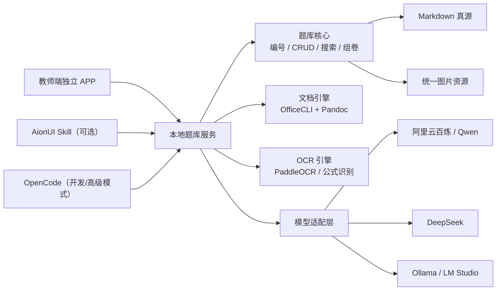

# 高中物理题库助手：独立 APP 实施规划

> 文档状态：正式规划基线  
> 最后更新：2026-07-28
> 当前阶段：阶段 6 已完成，按约定暂停，等待 Helios 检查；尚未进入阶段 7 打包
> 目标平台：Windows 10/11 x64，优先适配国内校园网络

## 1. 项目目标

本项目最终交付一个高中物理教师可以直接安装和使用的独立 Windows APP。教师不需要理解或安装 Python、Node.js、OpenCode、AionUI、Pandoc、OfficeCLI、Obsidian，也不需要打开命令行。

教师只需要完成以下工作流：

```text
导入 Word / PDF / 照片 / 答案
              ↓
      自动提取、切题和初步分类
              ↓
          教师审核确认
              ↓
            正式入库
              ↓
      搜索、筛选、自然语言找题
              ↓
            勾选组卷
              ↓
      导出可编辑 Word / PDF
```

最终验收不是“代码可以运行”，而是普通教师在一台全新 Windows 电脑上，下载安装后能够独立完成上述闭环。

## 2. 已确定的产品原则

以下决定作为长期基线。后续开发如需改变，必须先修改本规划并说明原因。

1. **独立 APP 是教师的唯一主要入口。**
2. **Markdown 是题目内容的唯一真源。** 数据库或索引只能作为可重建缓存。
3. **所有题目统一放在 `vault/题目/`，所有图片统一放在 `vault/assets/`。**
4. **一题一个 Markdown 文件。**
5. **题号、Markdown 文件名、图片前缀和导出展示编号保持一致。**
6. **核心功能离线可用，AI 是增强能力，不得成为录题、搜索或导出的硬依赖。**
7. **教师提供答案和解析。** AI 默认不解复杂题、不编造答案，只负责整理、匹配、分类和格式化。
8. **所有 AI 结果必须先进入草稿并由教师确认，不能直接修改正式题库。**
9. **国内网络优先。** 首次启动不得临时访问 GitHub、npm 或 PyPI 下载运行依赖。
10. **OpenCode、AionUI 和 Obsidian 均为可选扩展，不是教师端必需组件。**

## 3. 当前代码基线

当前仓库已经具备以下 MVP 能力：

- FastAPI 本地服务和中文网页界面；
- 手动录入题目、答案、解析和元数据；
- 自动编号和 Markdown 入库；
- 图片提取、统一命名和题号绑定；
- DOCX 经 Pandoc 转换为 Markdown 草稿；
- OpenCode 辅助拆分题目、答案和解析；
- 疑似公式图片检测与 OCR 确认；
- 按板块、类型、难度、年份、来源和知识点搜索；
- 勾选题目并导出 `exam.md` / `exam.docx`；
- Obsidian Vault 和常用插件配置。

当前主要缺口：

- 首次启动依赖 Python、pnpm、PyPI、npm 和 GitHub；
- 没有真正的 PDF/照片 OCR 和批量切题；
- 题库维护已经支持编辑、复制、批量标签、回收站、备份和检查；
- 组卷已经支持顺序调整、自定义展示题号、题型分组和三份分卷导出；
- Word 导出已经具备正式试卷模板、分页、页眉页脚和版式预览；
- 没有模型设置、国内接口、网络诊断和断网降级；
- 没有 Windows 安装包、自动化测试和教师真实环境验收。

## 4. 总体架构



### 4.1 教师端 APP

第一版不重写现有前端，继续使用当前 HTML/CSS/JavaScript 和 FastAPI：

- 使用 `pywebview` 将网页放入原生窗口；
- 使用 PyInstaller `onedir` 模式打包 Python 和后端；
- 使用 Inno Setup 生成 Windows 安装程序；
- 启动时不显示黑色终端窗口；
- 桌面和开始菜单只显示“高中物理题库助手”；
- 后续如有明显性能或维护需求，再评估 Tauri，不在当前阶段迁移。

### 4.2 数据目录

程序文件和教师数据必须分开：

```text
程序目录：
  C:\Program Files\高中物理题库助手\

默认数据目录：
  %USERPROFILE%\Documents\高中物理题库\
    ├─ 题目\
    ├─ assets\
    ├─ templates\
    ├─ exports\
    ├─ backups\
    └─ index.json

程序配置：
  %APPDATA%\PhysicsQuestionBankAssistant\
```

教师可以在设置中更换数据目录。软件升级不得覆盖题库数据。

## 5. 题库数据规范

### 5.1 题号规则

题号继续使用：

```text
板块代码 + 主类型代码 + 四位流水号
```

示例：

```text
LXCX0001
LXJS0001
DXYC0001
SYJD0001
```

板块代码：

| 代码 | 板块 |
|---|---|
| LX | 力学 |
| DX | 电学 |
| CD | 磁场与电磁感应 |
| GX | 光学 |
| RX | 热学 |
| XD | 近代物理 |
| SY | 实验 |
| ZH | 综合 |

主类型代码：

| 代码 | 类型 |
|---|---|
| JD | 经典题 |
| CX | 创新题 |
| JS | 计算量大 |
| YC | 易错题 |
| YZ | 压轴题 |
| JC | 基础题 |
| MX | 模型题 |

主类型只能有一个，其他属性放在可多选的“类型”字段中。

### 5.2 Markdown 元数据

正式题目统一使用以下最小结构：

```yaml
---
schema_version: 1
id: LXCX0001
板块: 力学
主类型: 创新题
类型:
  - 创新题
知识点:
  - 牛顿第二定律
难度系数: 0.63
年份: 2026
来源: 湖北高考
解析来源: 教师上传
图片:
  - LXCX0001_01.png
创建时间: 2026-07-18T10:00:00+08:00
更新时间: 2026-07-18T10:00:00+08:00
---
```

正文固定为：

```markdown
# 题目

# 答案

# 解析

# 备注
```

### 5.3 图片规则

- 图片全部保存在一个 `assets` 目录；
- 命名为 `题号_序号.扩展名`；
- 示例：`LXCX0001_01.png`、`LXCX0001_02.svg`；
- 删除题目时图片先移动到回收站，不立即永久删除；
- 系统提供“孤立图片检查”和“缺失图片检查”；
- 图片引用使用相对路径，不能写死某台电脑的绝对路径。

### 5.4 编号安全

- `index.json` 的更新必须使用文件锁和原子写入；
- 入库全部成功后才最终确认编号；
- 启动时可扫描题库并修复索引；
- 禁止通过普通编辑界面修改题号；
- 支持重复题检测，但不得仅凭题号判断内容重复。

## 6. 核心业务模块

### 6.1 教师任务导航与系统状态

界面固定为三个主板块：

1. **录入题库**：批量导入、录入单题；
2. **查看题库**：题库列表、题库维护、系统设置；
3. **导出题目**：组卷并导出。

日常页面只显示完成当前任务必需的文字。Word 引擎、图片识别、旧版公式和 AI 的状态
集中放在“系统设置”，不在录题和组卷页面重复出现。技术错误需要翻译为可操作的
中文提示，并提供“复制诊断信息”。

### 6.2 导入中心

支持以下输入：

1. 手动粘贴题目、答案和解析；
2. 单道题 DOCX；
3. 多道题 DOCX；
4. 数字 PDF；
5. 扫描 PDF；
6. PNG/JPG/手机照片；
7. 单独的答案或解析文件。

所有输入先进入“导入任务”，不得直接写入正式题库。

### 6.3 草稿审核

审核界面必须支持：

- 原文与识别结果对照；
- 题目、答案和解析分别编辑；
- 图片拖动、删除、排序和裁剪；
- 公式原图和 LaTeX 对照；
- 板块、主类型、其他类型、知识点和难度修改；
- 多题批量审核；
- 低置信度醒目标记；
- 单题确认或全部确认入库。

### 6.4 题库管理

必须支持：

- 搜索、筛选和排序；
- 题目详情预览；
- 编辑元数据和正文；
- 复制题目生成新题；
- 删除到回收站与恢复；
- 批量修改标签；
- 重建索引；
- 图片完整性检查；
- 题目内容导出和备份。

### 6.5 组卷

支持两种入口：

- 条件搜索后手动勾选；
- 自然语言描述后由 AI 推荐，教师最终确认。

组卷编辑器支持：

- 拖动调整顺序；
- 选择题、实验题、计算题分组；
- 修改试卷展示题号但保留内部题号；
- 设置标题、考试时间、总分、班级和姓名栏；
- 控制是否显示题库题号；
- 题目卷、答案卷、解析卷分别生成。

### 6.6 导出

导出格式优先级：

1. DOCX；
2. PDF；
3. Markdown。

每次导出生成独立文件：

```text
20260718_高二力学周测_题目.docx
20260718_高二力学周测_答案.docx
20260718_高二力学周测_解析.docx
```

不得再固定覆盖 `exam.docx`。

## 7. Office 文档方案

### 7.1 OfficeCLI 的职责

在安装包内置 OfficeCLI 单文件程序，由自己的后端调用，教师不直接操作命令行。

主要职责：

- 读取 DOCX 的结构、文字、图片、公式和样式；
- 按试卷模板创建和修改 DOCX；
- 插入公式、图片、页眉页脚、分页符和表格；
- 模板变量合并；
- 文档结构验证；
- 导出前生成预览，辅助检查版式。

OfficeCLI 及其他第三方组件必须在安装包中保留许可证和 NOTICE 文件。

### 7.2 Pandoc 的职责

Pandoc 暂时保留：

- Markdown 与 DOCX 的通用转换；
- 作为 OfficeCLI 失败时的降级方案；
- 使用 `reference.docx` 提供基础样式。

长期由测试结果决定 OfficeCLI 和 Pandoc 的具体分工，不在未验证前完全删除 Pandoc。

### 7.3 模板

至少内置：

- A4 单栏练习；
- A4 双栏练习；
- 正式考试卷；
- 题目 + 答案；
- 题目 + 答案 + 解析。

模板存放在数据目录 `templates/`，允许教师复制和替换，但程序必须提供恢复默认模板的功能。

## 8. OCR 与切题方案

### 8.1 分层处理

不同来源不能使用同一套强制流程：

| 输入 | 首选处理 | AI 是否必需 |
|---|---|---|
| DOCX | OfficeCLI / Pandoc 解析 | 否 |
| 数字 PDF | 本地文本与图片提取 | 否 |
| 扫描 PDF | 本地 OCR | 否，可增强 |
| 手机照片 | 图像预处理 + 本地 OCR | 否，可增强 |
| 复杂多题材料 | 规则切分 + AI 校正 | 否，可回退人工 |

### 8.2 OCR 引擎

优先评估 PaddleOCR：

- 普通中文文字使用轻量 OCR；
- 版面复杂、公式较多时使用结构识别；
- 公式识别结果必须保留原图并由教师确认；
- OCR 模型放入“完整离线版”，避免让所有用户都下载大型模型。

发行版本分为：

- **标准版**：体积小，支持 DOCX、数字 PDF 和在线 AI；
- **完整离线 OCR 版**：额外内置文字、版面和公式模型；
- 两个版本使用完全相同的题库数据格式。

### 8.3 多题切分和答案匹配

切题流程：

1. 识别原始题号、标题和页面位置；
2. 规则生成初步边界；
3. AI 只校正歧义边界；
4. 教师在审核界面合并或拆分；
5. 上传答案文件后按原始题号匹配；
6. 无法确定的匹配进入“待确认”，禁止自动入库。

## 9. AI 与智能体方案

### 9.1 AI 允许做的事

- 拆分题目、答案和解析；
- 判断板块和主类型；
- 从固定知识点字典中选择知识点；
- 判断“创新题、计算量大、易错、压轴”等标签；
- 匹配题目与教师上传的答案；
- 根据条件推荐题目并解释推荐理由；
- 检查缺失字段和疑似 OCR 错误。

### 9.2 AI 默认禁止做的事

- 未经允许自动生成复杂题答案；
- 用自己推导的答案覆盖教师答案；
- 未经确认直接写入正式题库；
- 批量删除或重命名正式题目；
- 将整个题库上传到模型服务；
- 在界面中向教师暴露命令行和编程概念。

### 9.3 模型适配层

后端建立统一接口，例如：

```python
class ModelProvider:
    def health_check(self): ...
    def extract_question(self, content): ...
    def classify_question(self, question): ...
    def match_answers(self, questions, answers): ...
    def recommend_questions(self, request, candidates): ...
```

首批支持：

1. 阿里云百炼 / Qwen，中国内地端点作为默认推荐；
2. DeepSeek 官方 API；
3. 自定义 OpenAI 兼容地址；
4. Ollama / LM Studio 本地接口。

所有输出采用固定 JSON Schema，并进行字段验证、超时、重试和错误降级。

### 9.4 OpenCode 的定位

OpenCode 不再是教师版的强制运行依赖，仅用于：

- 开发和调试；
- 高级用户的可选智能体入口；
- 在模型适配层尚未完成前提供临时兼容。

稳定版必须在完全未安装 OpenCode 时仍可运行全部非 AI 功能。

### 9.5 AionUI Skill 的定位

AionUI Skill 在独立 APP 稳定后开发，作为可选自然语言入口：

- Skill 只能调用本地 API 或题库 CLI；
- Skill 不直接写 `vault` 文件；
- 所有入库、删除和批量修改仍需独立 APP 审核；
- AionUI 的更新或不可用不得影响独立 APP。

## 10. 国内网络、隐私与安全

### 10.1 离线基线

断网时必须可用：

- 启动 APP；
- 手动录题；
- DOCX 和数字 PDF 基础导入；
- 题库搜索和编辑；
- 组卷；
- Word 导出；
- 备份和恢复。

断网时允许不可用：

- 云端 AI 自动分类；
- 云端视觉 OCR；
- 在线更新检查。

### 10.2 安装与更新

- 正式安装包内置所有基础运行依赖；
- 首次启动不执行 `pip install`、`npm install` 或 GitHub Release 下载；
- 更新文件优先放在国内对象存储；
- 必须同时提供离线升级包；
- 下载包需要校验 SHA-256；
- 更新失败不得损坏程序和题库；
- GitHub 仅作为源代码仓库，不作为教师端唯一下载源。

### 10.3 API Key 和数据

- API Key 存储在 Windows Credential Manager；
- 不写入 Markdown、日志、Git 仓库或明文配置；
- 调用云模型前明确显示将发送的内容；
- 默认只发送当前待处理题目，不发送整个题库；
- 提供“只使用本地功能”开关；
- 默认不收集遥测和教师题库内容。

### 10.4 国内网络测试矩阵

正式发布前至少测试：

- 校园有线网；
- 校园 Wi-Fi；
- 中国移动热点；
- 中国联通热点；
- 中国电信网络；
- 无管理员权限的 Windows 电脑；
- 未安装 Python、Node、Git、Office 和 Obsidian的电脑；
- 仅安装 WPS 的电脑；
- 完全断网环境。

## 11. 桌面打包与发行

### 11.1 安装版

- PyInstaller `onedir` 打包；
- pywebview 提供桌面窗口；
- Inno Setup 生成安装程序；
- 安装程序创建桌面快捷方式；
- 提供卸载程序，但卸载默认保留题库数据；
- 首次启动向导选择数据目录、模型服务和是否安装离线 OCR。

### 11.2 便携版

为学校机房或无管理员权限电脑提供便携 ZIP：

- 解压即可运行；
- 程序与数据仍分目录；
- 可以把数据目录放在移动硬盘；
- 不写系统级环境变量。

### 11.3 日志与诊断

- 日志默认存放在 `%APPDATA%`；
- 自动过滤 API Key 和题目正文；
- 设置页面提供“导出诊断包”；
- 诊断包只包含版本、依赖状态和错误日志，不包含题库内容，除非教师主动勾选。

## 12. 测试与质量门槛

### 12.1 自动化测试

至少覆盖：

- 题号生成、并发和索引修复；
- YAML/Markdown 读写往返；
- 图片重命名和引用；
- DOCX 导入；
- 搜索过滤；
- 编辑、删除、回收站和恢复；
- 组卷顺序；
- Word 导出和模板；
- 模型返回非法 JSON、超时和断网；
- 路径中包含中文和空格；
- 升级后旧题库兼容。

### 12.2 真实样本库

建立不提交版权材料的本地测试集，至少包含：

- 10 道纯文字题；
- 10 道带受力图、电路图、坐标图的题；
- 10 道带可编辑公式的 DOCX 题；
- 10 道旧版 MathType/OLE 公式题；
- 5 份多题 Word 试卷；
- 5 份数字 PDF；
- 5 份扫描 PDF 或手机照片；
- 5 份独立答案/解析文件。

### 12.3 发布门槛

教师测试版发布前必须满足：

1. 全新 Windows 11 电脑无需安装开发工具即可启动；
2. 断网情况下可完成手动录题、搜索、组卷和 Word 导出；
3. 普通 DOCX 导入不依赖 AI 或公式 OCR；
4. 导出的 DOCX 可被 Microsoft Word 和 WPS 正常打开；
5. 连续导入 100 道题不出现重复题号；
6. 软件崩溃不会损坏已入库题目；
7. 备份可以在另一台电脑恢复；
8. 国内普通网络可以连接至少一个默认模型服务；
9. 教师无需接触命令行即可完成主流程。

## 13. 分阶段实施计划

### 阶段 0：建立可靠基线

目标：先让现有 MVP 可测试、可持续修改。

- [x] 冻结并记录当前数据格式；
- [x] 建立 `tests/` 和基础自动化测试；
- [x] 建立不入 Git 的真实样本目录；
- [x] 统一“难度”和“难度系数”等字段；
- [x] 添加版本号和 `schema_version`；
- [x] 将 `app/main.py` 拆分为路由、服务和存储模块；
- [x] 建立错误处理和日志模块；
- [x] 更新 README，使开发文档和教师文档分离。

验收：现有功能通过自动化测试，重构前后生成的 Markdown 保持兼容。

### 阶段 1：离线核心解耦

目标：没有 OpenCode、公式 OCR 和网络时，基础系统仍完整可用。

- [x] Word 导入不再强制要求 OpenCode；
- [x] Word 无公式时不要求公式 OCR；
- [x] Agent 失败时回退到规则解析和人工编辑；
- [x] 增加题目编辑、删除、回收站和恢复；
- [x] 编号采用文件锁、原子写入和修复机制；
- [x] 增加自动备份和手动恢复；
- [x] 增加图片完整性检查；
- [x] 导出文件使用独立名称，不覆盖旧试卷。

验收：拔掉网络、移除 OpenCode 后仍能完成 DOCX 导入、入库、搜索和导出。

### 阶段 2：OfficeCLI 与正式试卷导出

目标：Word 成为可靠的教师交付格式。

- [x] 确认 OfficeCLI 版本、许可证和 Windows 二进制；
- [x] 新建统一 Office 服务封装；
- [x] 接入 DOCX 结构读取和模板合并；
- [x] 制作至少三套正式试卷模板；
- [x] 支持页眉页脚、分页、分栏和题号样式；
- [x] 生成题目卷、答案卷、解析卷；
- [x] 导出后执行验证和预览；
- [x] 保留 Pandoc 降级路径。

验收：典型物理题的文字、图片和公式可以稳定导出，并在 Word/WPS 中正确显示。

实施记录（2026-07-26）：固定并实测 OfficeCLI `1.0.142`，三套模板均通过结构校验；使用 Pandoc `3.10.1` 和 OfficeCLI 完成含中文、图片、可编辑公式、答案页与解析页的三页 DOCX 实际导出，结构校验通过且无可操作版式问题；教师端网页完成真实录题、勾选、导出和 HTML 预览闭环。Windows Word/WPS 的最终兼容性将随阶段 3 在全新 Windows 10/11 虚拟机继续验收。

### 阶段 3：题库管理与组卷工作流

目标：在打包前先把教师日常维护题库和组织试卷所需的功能补完整。

- [x] 增加全文搜索、题型筛选和多种排序；
- [x] 支持查看和编辑题目正文、答案、解析及元数据；
- [x] 复制题目时生成新题号并复制、重命名绑定图片；
- [x] 支持批量增加或移除类型和知识点；
- [x] 支持批量设置题型；
- [x] 支持删除到回收站、恢复、备份和完整性检查；
- [x] 组卷时支持调整题目顺序；
- [x] 支持修改试卷展示题号但保留内部永久题号；
- [x] 支持按选择题、实验题、计算题等题型分组；
- [x] 支持考试时间、满分、班级、姓名、学号和得分栏；
- [x] 支持分别生成题目卷、答案卷和解析卷。

验收：教师无需直接修改 Markdown，即可完成录题、维护、检索、排序、选题、
调整顺序、设置试卷信息和三份分卷导出。

实施记录（2026-07-26）：新增题目复制与图片安全重命名、批量标签/知识点/题型修改、
全文检索与排序、组卷顺序和展示题号编辑、题型分组及题目/答案/解析分卷导出；
相关服务、API 和网页流程通过 26 项自动化测试。

### 阶段 4：国内模型与智能分类

目标：在国内普通网络环境提供可切换、可降级的 AI 能力。

- [x] 建立统一 `ModelProvider` 接口；
- [x] 接入阿里云百炼/Qwen；
- [x] 接入 DeepSeek；
- [x] 支持自定义 OpenAI 兼容接口；
- [x] 支持 Ollama/LM Studio；
- [x] 设置页面提供 API Key、模型选择和连接测试；
- [x] API Key 通过系统 keyring 存入 Windows Credential Manager；
- [x] 使用 JSON Schema 和标准知识点字典校验模型输出；
- [x] 增加超时、重试、限流和断网降级；
- [x] AI 结果进入待确认草稿，不直接写正式题库。

验收：校园网和三大运营商网络至少有一个国内模型稳定可用，断网不影响核心功能。

实施记录（2026-07-26）：实现阿里云百炼、DeepSeek、自定义 OpenAI 兼容接口、
Ollama/LM Studio 统一适配；默认模型与端点依据当日官方文档设置。API Key 与普通
配置分离，云调用前必须确认，且只发送当前题目正文。分类输出经过固定 JSON Schema
和知识点字典校验后进入 `ai_drafts`，32 项自动化测试通过。真实校园网与三大运营商
连通性需要在阶段 8 使用教师目标环境完成，不把开发机联网等同于国内网络验收。

### 阶段 5：OCR、照片和批量切题

目标：覆盖教师最常见的 Word、PDF 和照片资源。

- [x] 接入数字 PDF 提取；
- [x] 接入 PaddleOCR 轻量文字识别；
- [x] 评估并接入版面和公式识别；
- [x] 增加图片旋转、裁剪、去阴影和透视校正；
- [x] 实现多题初步切分；
- [x] 实现可视化合并/拆分；
- [x] 实现题目卷与答案卷匹配；
- [x] 增加置信度和待确认队列；
- [x] 定义标准版与完整离线 OCR 版的依赖边界（安装包在阶段 7 制作）。

验收：真实 Word/PDF/照片样本可以批量形成可审核草稿，错误不会未经确认进入题库。

实施记录（2026-07-26）：新增 DOCX、数字/扫描 PDF 和照片批量导入中心；数字 PDF
使用 PyMuPDF 提取，扫描件和照片通过可选 PaddleOCR 3 本地适配器识别。实现旋转、
比例裁剪、去阴影增强、四点透视校正、按原题号初切、可视化合并/拆分、答案卷精确/
顺序回退匹配、置信度警告与逐题确认。无 OCR 时保留原图并要求人工录入；未经教师
勾选核对的草稿不能进入题库。完成 38 项自动化测试、浏览器界面检查和 PDF 渲染检查。

解析与图片复核记录（2026-07-28）：答案文件改为关键词辅助解析，可读取“答案、
解析/详解、难度、来源、知识点”等明确栏目，忽略栏目之前重复出现的原题；结构不明
的长内容留给教师手动填写。审核界面将答案与解析合并显示，底层仍分别存储，解析附图
会复制到对应题目草稿。图片裁剪和四点透视改为图形化操作；去阴影支持取消并保留其他
旋转/裁剪结果，同时提供恢复原图。图片处理后以当前题为锚点恢复滚动位置。使用
《圆周运动（一）》题目版与教师版实测 42 道题，全部匹配，难度、来源和知识点正确
读取，6 张解析附图随题保留，原题未重复进入解析。

### 阶段 6：智能找题与可选 AionUI Skill

目标：在稳定核心之上提供真正的题库智能体体验。

- [x] 实现自然语言查询到结构化筛选；
- [x] 先本地筛选候选题，再将最少必要信息发给模型；
- [x] AI 给出推荐理由，教师最终勾选；
- [x] 实现按时间、难度和知识点约束的组卷建议；
- [x] 提供本地题库 CLI/API；
- [x] 创建 AionUI 自定义 Assistant 和 Skill；
- [x] Skill 仅调用本地 API，不直接写题库；
- [x] 保留 OpenCode 高级接入文档。

验收：教师可用自然语言找题和组卷；AionUI 不存在时独立 APP 功能完全不受影响。

实施记录（2026-07-26）：新增本地自然语言解析器，可识别题量、时长、板块、主类型、
题型、知识点、年份/近几年、难度和答案/解析完整性要求；先严格筛选本地题库，再按
匹配度和预计答题时间生成候选。可选模型只接收本地候选的最少元数据与短预览，失败
自动保留本地排序。网页支持逐题或一键加入组卷；新增本地 CLI 与 API。依据 AionUI
当前官方自定义 Skill 规范创建 `physics-question-bank` Skill、Rules 和标准库 API
客户端，Skill 不直接写题库。完成 45 项自动化测试、Skill 校验、客户端实跑和浏览器
端“自然语言推荐 → 加入组卷”检查。

界面复核记录（2026-07-26）：将原先纵向堆叠的单页表单改为任务型首页，提供“批量导入、
单题录入、智能找题、组卷导出”四个主要入口，并将题库维护、AI 设置作为独立工作区；
顶部持续显示 Pandoc、OfficeCLI、OCR 和 AI 可用状态。macOS 开发启动器增加 Pandoc
自动准备流程，已使用 Pandoc `3.10.1` 和 OfficeCLI 实际生成并复核 DOCX。

三板块界面复核记录（2026-07-28）：移除中间首页和七项平铺导航，固定为“录入题库、
查看题库、导出题目”三个主板块，并在当前板块下显示二级入口。批量导入、单题录入、
题库列表、维护、设置和组卷功能均保留。去除重复的技术说明和空状态提示，系统组件
状态集中到“系统设置”，筛选条件默认收起，老师进入页面后只先看到当前任务。桌面和
390 像素窄屏浏览器检查通过，自动化测试增至 82 项。

导入审核预览复核记录（2026-07-28）：导入草稿标题只显示当前顺序和原题号，不再显示
识别置信度或整段黄色技术提示。完整排版预览移动到“答案与解析”之后，并分别呈现题目、
答案和解析，使三个部分中的文字、公式和图片可以在同一处连续核对。

公式与图片复核记录（2026-07-28）：网页增加本地公式预览、行内/独立公式插入按钮和
格式校验；Word 可编辑公式在导入后统一为标准公式文本，导出为可继续编辑的 Word
公式。旧版 MathType/OLE 公式优先读取内部 MTEF 结构，经 MathML 转成可编辑公式并
保持原位置；单个转换失败时保留对应预览图并要求教师复核。使用
《万有引力定律（一）》实测 178 个旧版公式全部转换成功，28 张普通题图位置保留，
普通斜体和导出后的 Word 公式均通过复核。上传图片可以放入题目、答案
或解析，支持预览、移除和后续编辑；只保存正文实际使用的图片，常见位图统一为 PNG，
试卷中默认按正文宽度的 70% 排版。公式预览组件随项目本地提供，不访问 CDN。教师端
文案统一改为任务和动作表达，隐藏 Markdown、OCR、Pandoc、OfficeCLI 等实现术语。
相关自动化测试增至 58 项。

换行一致性复核（2026-07-28）：统一网页预览、Markdown 存储和 Pandoc Word 导出的
换行语义。一次回车生成 Word 软换行，空一行表示段落；Word 导入产生的 A/B/C/D
引用标记和选项间空行会自动整理。旧题无需重新入库，导出时同样应用新规则。使用现有
两道真实题生成 DOCX，确认选项写入独立 `w:br` 换行、图片与公式位置正常；自动化测试
增至 64 项。

### 阶段 7：独立 Windows APP

目标：教师只安装一个软件，不再接触浏览器和黑色终端。本阶段按当前约定延后，
在阶段 6 功能验收完成后再启动。

- [ ] 接入 pywebview；
- [ ] 将数据目录从程序目录分离；
- [ ] 制作首次启动向导；
- [ ] 使用 PyInstaller 打包；
- [ ] 使用 Inno Setup 制作安装版；
- [ ] 制作免安装便携版；
- [ ] 内置 Python、OfficeCLI、Pandoc 和许可证文件；
- [ ] 增加应用图标、版本信息和卸载流程；
- [ ] 在全新 Windows 10/11 虚拟机验收。

验收：无 Python、Node、Git、Office 的电脑可以从桌面图标完成基础闭环。

### 阶段 8：教师试点与正式发布

目标：用真实教师工作流验证，而不是只做技术演示。

- [ ] 邀请 3～5 位高中物理教师；
- [ ] 每位教师导入至少一份真实 Word/PDF/照片材料；
- [ ] 每位教师独立完成一次搜索组卷和 Word 导出；
- [ ] 记录完成时间、错误点和需要帮助的步骤；
- [ ] 修复阻断问题；
- [ ] 完善内置帮助、示例和故障诊断；
- [ ] 完成第三方许可证清单；
- [ ] 生成正式安装包、便携包和离线升级包。

验收：未接受编程培训的教师可以根据界面独立完成主要任务。

## 14. 明确不在当前范围内

在教师版稳定之前不做：

- 多人在线协作服务器；
- 手机原生 APP；
- 商业账号和收费系统；
- 学生端作答平台；
- AI 自动生成大量复杂题解析；
- 云端集中存储所有教师题库；
- 重型知识图谱可视化；
- 为了追求技术新颖而重写成熟模块。

## 15. 主要风险与应对

| 风险 | 应对 |
|---|---|
| 国内无法稳定下载 GitHub/PyPI/npm | 安装包内置依赖，国内镜像和离线升级 |
| 不同 Word/WPS 排版结果不同 | OfficeCLI + Pandoc 双路径，建立真实模板测试集 |
| 公式 OCR 错误 | 保留原图、显示对照、必须教师确认 |
| AI 分类不稳定 | 固定字典、JSON Schema、置信度、人工审核 |
| 大模型服务临时不可用 | 多国内 Provider + 本地模型 + 完整离线降级 |
| 题号冲突或文件损坏 | 文件锁、原子写入、备份、恢复和索引修复 |
| 题库变大后搜索变慢 | 建立可重建索引缓存，Markdown 仍为真源 |
| 安装包过大 | 标准版与完整离线 OCR 版分离 |
| 用户误操作 | 回收站、版本备份、危险操作二次确认 |

## 16. 后续每次开发的执行规则

以后让 Codex 按本规划继续开发时，遵循以下流程：

1. 开始前阅读本文件和仓库中的 `AGENTS.md`（如果以后创建）；
2. 明确本次只属于哪个阶段，不跨阶段堆功能；
3. 先检查工作区状态，保护已有用户修改；
4. 先补测试或验收样本，再修改高风险核心逻辑；
5. 不改变题号和 Markdown 数据规范，除非先增加迁移方案；
6. 不把新的云服务设为核心功能的硬依赖；
7. 不在首次启动临时安装大型依赖；
8. 完成后运行对应测试并进行实际界面验证；
9. 更新本文件中对应阶段的复选框和“实施记录”；
10. 每个阶段单独提交，提交信息清楚说明结果。

推荐的后续指令格式：

```text
请读取《项目实施规划.md》，按照“阶段 0：建立可靠基线”开始实施。
先检查现有代码和工作区状态，只完成阶段 0，不提前进入下一阶段。
实现后运行测试，更新规划中的复选框，并向我说明完成内容和剩余风险。
```

## 17. 实施记录

| 日期 | 阶段 | 结果 | 提交 |
|---|---|---|---|
| 2026-07-18 | 规划基线 | 确定独立 APP、离线优先、OfficeCLI 内置、国内模型适配和可选 AionUI Skill 路线 | 阶段 0 基线提交 |
| 2026-07-26 | 阶段 0 | 冻结 schema v1；拆分 config/storage/services/api；加入版本、日志、统一错误；建立开发文档、真实样本约定和 6 项自动化测试 | 阶段 0 基线提交 |
| 2026-07-26 | 阶段 1 | 基础 DOCX 导入与 OpenCode/公式 OCR 解耦；加入安全编号、编辑、回收站、恢复、自动/手动备份、图片检查和独立试卷文件；17 项自动化测试及完整网页闭环验收通过 | 阶段 1 提交 |
| 2026-07-26 | 阶段 2 | 固定 OfficeCLI 与 Pandoc，制作三套正式模板，完成结构校验、预览及题目/答案/解析 Word 导出 | 阶段 2 提交 |
| 2026-07-26 | 阶段 3 | 新增复制、批量修改、全文检索与排序、组卷顺序和展示题号、题型分组及三份分卷导出，26 项测试通过 | 阶段 3 提交 |
| 2026-07-26 | 阶段 4 | 接入国内云模型和本地模型，完成系统凭据、连接测试、标准字典、结构校验、超时重试及人工确认草稿，32 项测试通过 | 阶段 4 提交 |
| 2026-07-26 | 阶段 5 | 完成 DOCX/PDF/照片批量导入、图片处理、切题、答案匹配和逐题确认，无文字识别组件时安全退回人工录入 | 阶段 5 提交 |
| 2026-07-26 | 阶段 6 | 完成自然语言找题、本地优先推荐、AionUI Skill、任务型界面，以及公式与图片的完整导入、编辑和 Word 导出链路 | 阶段 6 提交 |
| 2026-07-28 | 阶段 6 补充 | 旧版 MathType/OLE 公式改为离线结构化读取，真实样例 178/178 转为可编辑公式；失败时只回退对应原图 | 本次提交 |
| 2026-07-28 | 阶段 6 补充 | 统一录入预览、题库和 Word 的换行规则；选项自动紧凑排列，旧题导出同步生效 | 本次提交 |
| 2026-07-28 | 阶段 6 补充 | 自动识别同一行横向排列的连续 A/B/C/D 选项（兼容 Word 将 Tab 转为空格），并在录入、预览、存储和导出时统一改为一项一行 | 本次提交 |
| 2026-07-28 | 阶段 6 补充 | 补充识别“A/B 一行、C/D 一行”的两列选择题排版，旧审核草稿、导入、预览和 Word 导出统一拆成四行 | 本次提交 |
| 2026-07-28 | 阶段 6 补充 | 界面收敛为“录入题库、查看题库、导出题目”三个主板块，功能按二级入口归类并精简无关提示 | 本次提交 |
| 2026-07-28 | 阶段 6 补充 | 导入草稿移除置信度和黄色技术提示，将题目、答案、解析的公式与图片完整预览统一放到解析之后 | 本次提交 |

## 18. 官方技术参考

后续实现和升级第三方组件时，优先以官方资料为准：

- [OfficeCLI](https://github.com/iOfficeAI/OfficeCLI)
- [AionUI](https://github.com/iOfficeAI/AionUi)
- [Pandoc](https://pandoc.org/)
- [OpenCode Providers](https://opencode.ai/docs/providers)
- [PaddleOCR](https://github.com/PaddlePaddle/PaddleOCR)
- [阿里云百炼 / Qwen API](https://help.aliyun.com/zh/model-studio/first-api-call-to-qwen)
- [DeepSeek API](https://api-docs.deepseek.com/)

每次锁定发行版本时，需要重新核对许可证、系统要求、模型名称和 API 兼容性，不能仅依赖本规划记录的历史信息。
